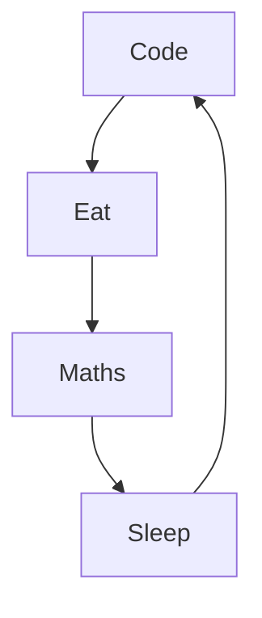

# 👋-Hello World!

Je suis Lucas, un jeune étudiant français en mathématiques appliqués à [CY Tech](https://cytech.cyu.fr)(Ex-EISTI) en cycle ingénieur 👨‍🎓. Je suis passioné des sciences et des nouvelles technologies.

En ce moment:
- 🔭 Je recherche un stage dans le domaine de la programmation de début juin à début aout d'une durée de 2 à 3 mois
- 🌱 J'apprends des tas de choses géniales qui me seront utiles à l'avenir
- 👯 Je participe activement à la vie associative de mon école 
- ⚡ Fun fact : J'ai vécu 14 ans en Afrique ✈️

	
	&nbsp;
	

# 🧠-Compétences Informatique

<table align="center">
	<thead>
		<tr>
			<th colspan="2"><b>Langage généraliste</b></th>
        </tr>
        </thead>
	<tbody>
        <tr>
            <td align="center"> </td>
            <td align="center"></td>
        </tr>
    </tbody>
</table>
<table align="center">
	<thead>
		<tr>
			<th colspan="4"><b>Développement web</b></th>
        </tr>
        </thead>
	<tbody>
        <tr>
            <td align="center"></td>
            <td align="center"></td>
            <td align="center"></td>
            <td align="center"></td>
        </tr>
    </tbody>
</table>
<table align="center">
	<thead>
		<tr>
			<th colspan="2"><b>Environnement Unix</b></th>
        </tr>
        </thead>
	<tbody>
        <tr>
            <td align="center">
            <picture>
                <source media ="(prefers-color-scheme: dark)" srcset="https://bashlogo.com/img/symbol/png/full_colored_light.png">
                <source media ="(prefers-color-scheme: light)" srcset="https://cdn.jsdelivr.net/gh/devicons/devicon/icons/bash/bash-original.svg">
                
            </picture></td>
            <td align="center"><picture>
                <source media="(prefers-color-scheme: dark)" srcset="https://raw.githubusercontent.com/GiorgosXou/Random-stuff/main/Programming/StackOverflow/Answers/70200610_11465149/w.png">
                <source media="(prefers-color-scheme: light)" srcset="https://raw.githubusercontent.com/GiorgosXou/Random-stuff/main/Programming/StackOverflow/Answers/70200610_11465149/b.png">
                
                </picture>
            </td>
        </tr>
    </tbody>
</table>
<table align="center">
	<thead>
		<tr>
			<th colspan="1"><b>Base de données</b></th>
            <th colspan="1"><b>Outils</b></th>
        </tr>
        </thead>
	<tbody>
        <tr>
            <td align="center"> </td>
            <td align="center"></td>
        </tr>
    </tbody>
</table>

## Ma daily routine :

## 🔥 Activité récente
<!--RECENT_ACTIVITY:last_update-->
Last Updated: Wednesday, November 23rd, 2022, 4:23:36 PM
<!--RECENT_ACTIVITY:last_update_end-->

<!--RECENT_ACTIVITY:start-->
1. ⬆️ Pushed 2 commit(s) to [LucasThuPingOne/LucasThuPingOne](https://github.com/LucasThuPingOne/LucasThuPingOne)
2. ⬆️ Pushed 2 commit(s) to [LucasThuPingOne/LucasThuPingOne](https://github.com/LucasThuPingOne/LucasThuPingOne)
3. ⬆️ Pushed 1 commit(s) to [LucasThuPingOne/LucasThuPingOne](https://github.com/LucasThuPingOne/LucasThuPingOne)
4. ⬆️ Pushed 1 commit(s) to [LucasThuPingOne/LucasThuPingOne](https://github.com/LucasThuPingOne/LucasThuPingOne)
5. ⬆️ Pushed 1 commit(s) to [LucasThuPingOne/LucasThuPingOne](https://github.com/LucasThuPingOne/LucasThuPingOne)
<!--RECENT_ACTIVITY:end-->

## 📊 GitHub Stats

    
    

    
    
    
    

    